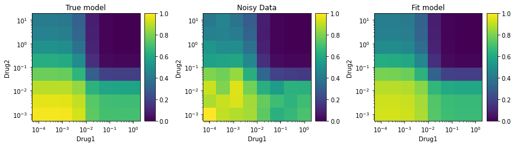

# synergy

A python package to calculate, analyze, and visualize drug combination synergy and antagonism. Currently supports multiple models of synergy, including MuSyC, Bliss, Loewe, Combination Index, ZIP, Zimmer, BRAID, Schindler, and HSA.

## Installation

Using PIP
`pip install synergy`

Using conda
`not yet`

Using git
`git clone ...`

## Example Usage

### Generate synthetic data to fit
```python
from synergy.combination import MuSyC
from synergy.utils.dose_tools import grid
```

Initialize a model. I will use the `MuSyC` synergy model to generate data, but it could be done using `Zimmer` or `BRAID` as well.


```python
E0, E1, E2, E3 = 1, 0.7, 0.4, 0.
h1, h2 = 2.3, 0.8
C1, C2 = 1e-2, 1e-1
oalpha12, oalpha21 = 3.2, 1.1
gamma12, gamma21 = 2.5, 0.8

truemodel = MuSyC(E0=E0, E1=E1, E2=E2, E3=E3, h1=h1, h2=h2, C1=C1, C2=C2,	\
                  oalpha12=oalpha12, oalpha21=oalpha21, gamma12=gamma12, 	\
                  gamma21=gamma21)
```

Display the model's parameters


```python
print(truemodel)
```

    MuSyC(E0=1.00, E1=0.70, E2=0.40, E3=0.00, h1=2.30, h2=0.80, C1=1.00e-02, C2=1.00e-01, oalpha12=3.20, oalpha21=1.10, beta=0.67, gamma12=2.50, gamma21=0.80)

Evaluate the model at doses d1=C1, d2=C2 (a combination of the EC50 of each drug)

```python
print(truemodel.E(C1, C2))
```

    0.3665489890285983

Generate a dose sampling grid to make "measurements" at. Drug 1 will be sampled at 8 doses, logarithmically spaced from C1/100 to C1*100. Drug 2 will be likewise sampled around C2. (8 doses of Drug 1) X (8 doses of Drug 2) = 64 total measurements.

```python
d1, d2 = grid(C1/1e2, C1*1e2, C2/1e2, C2*1e2, 8, 8)
print(d1.shape, d2.shape)
```

    (64,) (64,)

Evaluate the model at those 64 dose combinations

```python
E = truemodel.E(d1, d2)
print(E.shape)
```

    (64,)

Add noise to get imperfect data

```python
import numpy as np

E_noisy = E * (1+0.1*(2*np.random.rand(len(E))-1))
print(E_noisy.shape)
```

    (64,)

### Fit synergy model to data
Create a new synergy model to fit using the synthetic data. Here I use `MuSyC`, which is the same model we used to generate the synthetic data. `bootstrap_iterations` are used to get confidence intervals.

```python
model = MuSyC()
model.fit(d1, d2, E_noisy, bootstrap_iterations=100)
print(model)
```

    MuSyC(E0=0.93, E1=0.68, E2=0.42, E3=0.00, h1=1.86, h2=1.12, C1=9.64e-03, C2=1.24e-01, oalpha12=3.75, oalpha21=1.08, beta=0.81, gamma12=2.01, gamma21=0.98)

This prints the lower and upper bound confidence intervals (defaults to 95%) for each parameter.

```python
print(model.get_parameter_range().T)
```

    [[ 0.91223345  0.96329156]
     [ 0.64643766  0.70749396]
     [ 0.39022822  0.44990642]
     [-0.02507603  0.02363363]
     [ 1.26005438  2.73713318]
     [ 0.93018994  1.43865508]
     [ 0.00760803  0.01384544]
     [ 0.10018859  0.15263104]
     [ 2.85988609  4.6230902 ]
     [ 0.73239517  1.79969918]
     [ 0.69827786  0.95770258]
     [ 1.44083572  2.76863031]
     [ 0.56548907  1.83905139]]

### Visualize

```python
from matplotlib import pyplot as plt
from synergy.utils import plots

fig = plt.figure(figsize=(12,6))

ax = fig.add_subplot(131)
truemodel.plot_colormap(d1, d2, xlabel="Drug1", ylabel="Drug2", title="True model", ax=ax, vmin=0, vmax=1)

ax = fig.add_subplot(132)
plots.plot_colormap(d1, d2, E_noisy, ax=ax, title="Noisy Data", cmap="viridis", xlabel="Drug1", ylabel="Drug2", vmin=0, vmax=1)

ax = fig.add_subplot(133)
model.plot_colormap(d1, d2, xlabel="Drug1", ylabel="Drug2", title="Fit model", ax=ax, vmin=0, vmax=1)

plt.tight_layout()
```





```python

```
